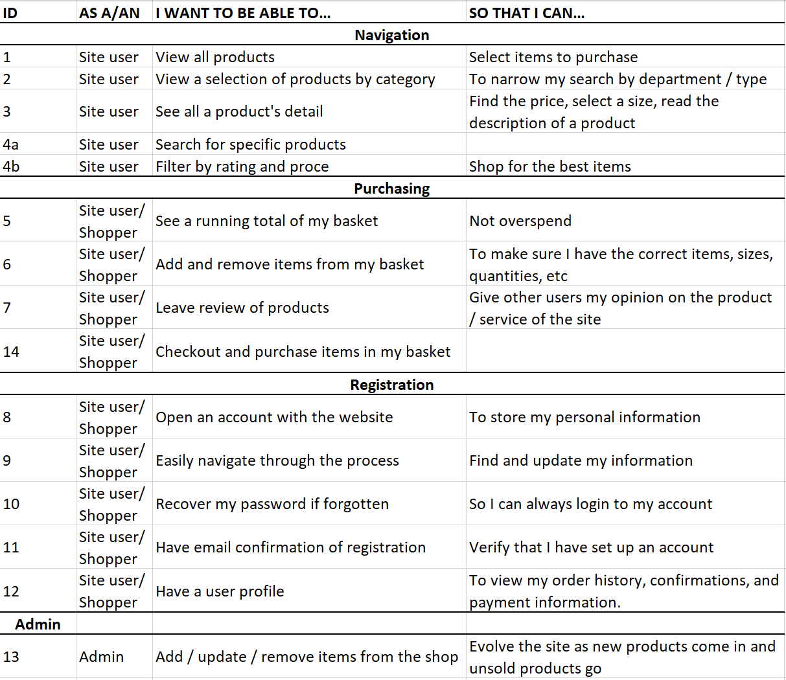

# SnapShot

**Disclaimer: Do not use your own credit/debit card to purchase anything from this website - no orders will be fulfilled. This site was created as a course project and will not ship any orders although you may still be charged. If you wish to test the purchasing feature please use the following card details:**

```
Card number: 4242 4242 4242 4242 
Expiry date: 4/24
CVC: 242
ZIP: 42424
```
***

SnapShot is an E-commerce store where users can browse and search for art, both digital and physical, which they can purchase using Stripe Payments. The idea of the site is an online shop for an independent artist, where they can upload and sell the art they create. Prices and descriptions can be altered to improve the selling rate of certain products, and items can be deleted outright at the shop owners discretion. The conception of this project was for a Milestone 5 project for Code Institute.

You can view the live project [here](https://snap-shot-store.herokuapp.com/).


## Contents 

- [User Experience (UX)](#user-experience-ux)
   * [User Stories](#user-stories) 
      + [Current Features](#current-features)
      + [Features to implement in the future](#future-features)
   * [Structure](#structure)
   * [Wireframes](#wireframes)
   * [Colour Scheme](#colour-scheme)
   * [Typography](#typography)
   * [Imagery](#imagery)
   * [Design Choices](#design-choices)
- [Technologies](#technologies)
   * [Languages used](#languages-used)
   * [Frameworks, Libraries & Programs Used](#frameworks-libraries-and-programs-used)

- [Challenges](#challenges)

- [Testing](#testing)
   
- [Deployment](#deployment)
   * [Creation](#creation)
   * [Forking](#forking)
   * [Clone](#clone)
   * [Setting up AWS](#setting-up-aws)
   * [Setting Up Stripe](#setting-up-stripe)
   * [Setting Up Project](#setting-up-project)
   * [Heroku Deployment](#heroku-deployment)

- [Credits](#credits)
   * [Code](#code)
   * [Content](#content)
   * [Media](#media)
   * [Acknowledgements](#acknowledgements)


## User Experience / Interaction (UX / UI)

   ### User Stories

   - #### Unregistered Visitor
     - As an unregistered user, I want to be able to: 
        - View all products so that I can select items to purchase.
        - View a selection of products by category so that I can narrow my search by type.
        - See all a product's detail so that I can find the price, select a size, and read the description of a product.
        - Search for specific products so that I can find exactly what I am looking for.
        - Filter by rating and price so that I can shop for the best items.


   - #### First Time Visitor (in addition to above)
     - As a first time user, I want to be able to:
       - Navigate the site easily and intuitively.
       - Find what I am looking for easily. 
       - Keep track of my basket total so I do not overspend.
       - Add and remove item's from my basket so I can make sure I have the correct items, sizes, and quantities.
       - Checkout easily and be sent confirmation of my purchase to my email.


   - #### Registered Returning Visitor Goals
     - As a registered user, I want to be able to:
       - Save my checkout information so I can purchase items easier the next time I visit the site.
       - Sign up to a news letter so that I can be told about special offers and savings.
       - Update my information when it changes so that my items are aways delivered to the correct address.
       - Recieve an email to verify my registration so that I can be sure I have an account.
       - Change and recover my password so I do not have to create a new account if I forget it.
       - Access a profile so that I can view my order history, confirmations, and payment information.

   - #### Superuser goals
     - As a superuser / admin, I want to be able to:
       - Add, edit, and remove items from the site so that I can sell more products and remove the products that are not being sold to improve revenue.

- A list of user stories used in production can be seen below:




   ### Current features 

     - Responsive design to work on all screens
     - Accessibility
     - Easy to navigate (Single use learning)
     - Interactive elements
     - Social Links
     - Logged in / out status changes for a user depending on their current status.
     - Able to search products by keywords.
     - Able to view products using predefined filtes including price, rating, and category.
     - 'Back to top' button.
     - Logged in user can save an address for future purchases.
     - A user profile so a logged in user can update their information as and when it changes.
     - Admin / superuser has full CRUD control of the site.
     - Confirmation emails for registration and purchase.

   ### Future features

     - Logged in users will be able to rate products in their reviews, which will update the rating in the database. This will dynamically alter the products page when filtering by rating. Furthermore, it will allow more user interaction with the store and improve user experience.

### Structure

#### Testimonies 

| user | body | 
| --- | --- | 
| ForeignKey(User) | TextField | 

#### Category

| name | friendly_name |
|------|---------------|
| physical | Physical |
| digital | Digital |

#### Product

| category | name | description | price | rating | image_url | image | sizes | 
| --- | --- | --- | --- | --- | --- | --- | --- |
| ForeignKey(Category) | CharField | TextArea | DecimalField | DecimalField | URLField | ImageField | BooleanField |

#### Review

| user | text | product |
| --- | --- | --- |
| ForeignKey(User) | TextField | ForeignKey(Product) |

#### Order 

| order_no | user_profile | name | email | phone_number | country | county | city | address_1 | address_2 | postcode | delivery_amount | order_amount | grand_total | date | original_basket | stripe_pid | 
| --- | --- | --- | --- | --- | --- | --- | --- | --- | --- | --- | --- | --- | --- | --- | --- | --- | 
| CharField | ForeignKey(Profile) | CharField | CharField | CharField | CharField | CharField | CharField | CharField | CharField | CharField | DecimalField |  DecimalField |  DecimalField | DateTimeField | TextField | CharField | 

#### OrderLineItem 

| order | product | product_size | quantity | lineitem_total | 
| --- | --- | --- | --- | --- |
| ForeignKey(Order) | ForeignKey(Product) | CharField | IntegerField | DecimalField | 

### WireFrames 


### Color Scheme
    
- The color scheme follows a similar color scheme to an earlier project of mine: Be Mindful. A simplistic off-white and grey color scheme with just the pops of color from the images used for the products accent the interactable portions of the site. The product detail pages have the product image as a blurred backdrop to darken the page slightly which emphasizes the white boxes that contain the product information. 

        
### Typography

- The main font used throughout the site is Barlow fron Google Fonts which was chosen for its simplistic typeface. The site has a clear purpose and the typeface should not get in the way of that. As such Barlow is easy to read and is typed in a color the easily contrasts the background to that all the informaiton is easily accessable.

### Imagery

- As discussed later, all the imagery was generated by [DALLE](https://huggingface.co/spaces/dalle-mini/dalle-mini) which takes a prompt and generates images based off its AI.

- The logo for the site was generated by [Smashing Logo](https://smashinglogo.com/en/) which is an excellent service for generating logos in various styles.

### Design Choices

- As the site "sells" artwork of varying types, I wanted these to be "center stage" for the majority of the user interaction process. A plain white background allows for the image to be shown without having to fight to be seen amongst other colors or images on the screen resulting in bad contrast. Hovering on a product card momentarily zooms in the image to give the user an imediate response to their action. Clicking the card will then take them to the product page where they can choose quantity and sizes should the product have them. 

- There are two nav-bars at the top of the screen. The main nav-bar give the user the ability to search for products at a click; by filters or by category. The other nav-bar contains link to user profile actions: login / logout, register, and a link to the user profile.

- The main nav-bar sticks to the top of the screen so that the user can always go back to browsing wherever they are within the site.

- The checkout process was made as simple as possible. From loading the site, it takes a minimum of 6 clicks to place an order.
 
## Technologies 

### Languages Used

-   HTML5
-   CSS3
-   JavaScript and jQuery
-   Python and Django

### Frameworks, Libraries and Programs Used

- [Bootstrap v4.6.0](https://getbootstrap.com/docs/4.6.0/getting-started/introduction/)
- [Google Fonts](https://fonts.google.com/)
- [Git](https://git-scm.com/)
- [GitHub](https://github.com/)
- [Gitpod](https://www.gitpod.io/)
- [Am I responsive](http://ami.responsivedesign.is/)
- [Chrome devtools](https://developer.chrome.com/docs/devtools/)
- [jQuery](https://jquery.com/)
- [Heroku](https://dashboard.heroku.com/apps)
- [Postgres](https://www.postgresql.org/)
- [Django](https://www.djangoproject.com/)
- [Stripe](https://stripe.com/gb)
- [Django Secret Key Generator](https://djecrety.ir/)
- [AWS](https://aws.amazon.com/)

## Challenges 

- Days before this project was due for submission, the login / registration pages started throwing 500 Internal Server Errors, as well as the Django admin panel should you try to update the user model. After multiple days of attempting to debug, it turned out to be an error with the email handling functionality. After resetting the email host password, the errors were no longer being thrown. Still unsure, however, as to why this error presented itself days after the functionality was originally implemented.

## Testing

Testing and results can be found [here](TESTING.md)

## Deployment

 - ### Creation 
   - This project was created using Code Institute's Full Gitpod Template following these steps: 

     1. Sign into a Github profile.
     2. Click "New" next to recent repositories.
     3. Select ```Code-Institute-Org/gitpod-full-template``` in the templates dropdown.
     4. Give it a name and a description (optional).
     5. Set the repo to public.
     6. Click "Create repository".

   - Once inside the repository, click the green "Gitpod" button to open the IDE.

   - ### Forking
     - To fork this project:

      1. Navigate the repository on Github.
      2. Click "Fork" in the top right of the screen.
      3. (Optional) Re-name the repository and give it a description.
      4. Click "Create fork".
   
   - Once inside the repository, click the green "Gitpod" button to open the IDE.

  - ### Clone
    - Note: in your command line, make sure you are located within the directory that you want the project to be cloned into.
     - To clone this project:

      1. Navigate to the project repository.
      2. Click the "Code" dropdown menu.
      3. Select either HTTPS or SSH depending on your preference.
      4. Copy the link generated for you.
      5. Open your IDE of choice.
      6. In the command line, type:
         - ``` git clone <your copied link> ```
      7. Hit enter and the repository files will be cloned into your IDE.

- ### Setting Up Project
  - Once you have the project open in your IDE, you will need to download some dependencies to make sure the project works as expected. 

  1. Firstly, install Django 3.2 with:
    - ``` pip3 install Django==3.2 ```
  
  2. Next, ``` pip3 install ``` the following dependencies:
    - boto
    - botocore
    - dj-database-url
    - Django
    - django-allauth
    - django-countries
    - django-storages
    - gunicorn
    - Pillow
    - psycopg2-binary
    - stripe
  
  3. In the command line, run ``` python3 manage.py makemigrations ``` followed by ``` python3 manage.py migrate ``` to migrate all the models.

  4. In the command line, run ``` python3 manage.py runserver ``` to run the project in the browser. 
 
- ### Setting up AWS

  - Create an account with AWS at [this link](https://aws.amazon.com/). Using the search bar, navigate to the S3 service and click "Create Bucket". Inside the form, name the bucket and deselect "Block all public access". Click "Create Bucket".

  - Inside this bucket. in the "Properties" tab, find "Static Website Hosting" and click edit. Select enable and fill in index.html with ``` index.html ``` and error.html with ``` error.html ```. This project does not require this but it is necessary for the bucket.
  
  - Inside the "Permissions" tab, paste the following into the CORS section:

  ```
    [
    {
        "AllowedHeaders": [
            "Authorization"
        ],
        "AllowedMethods": [
            "GET"
        ],
        "AllowedOrigins": [
            "*"
        ],
        "ExposeHeaders": []
    }
    ]
  ```

  - Then, in "Bucket Policy", click "Edit", followed by "Policy Generator" which will open in a new tab, and fill in the form with these values:
    - Type: S3 Bucket Policy
    - Effect:  Allow
    - Principal: *
    - AWS Service: Amazon S3
    - Actions: Get Object
    - Amazon Resource Name: paste in the "Bucket ARN" from the previous page.
  
  - In the AWS search bar, search for IAM and click the top result.
  - Inside IAM, click "User Grounps" and then "Create User Group".
  - Name the user groups and click "Creat Group".

  - In the side menu, click Policies, then "Create Policy". In the JSON tab, click "Import Managed Policy" and select "Amazon S3 Full Access". Inside the JSON code, in the "Resource" key, paste in your Bucket ARN from earlier and append ``` /*``` to the end.
  - Click through until the end of the process until you see "Revise Policy" where you can give your policy and name and a description. Then click "Create Policy".

  - Inside the User Group you just created, click the "Permissions" tab and attach the policy you just created.

  - In the IAM menu, click "Users", then "Add user". Give the user a name and select "Access Key Programmatic Access"., then click "Next".
  - Add your new user to your group, click "Next" and finally "Create User".

  - From here, download the CSV file and save it. **This will be the only time you can do this so save it somewhere you won't accidentally delete it.**

  - Open your downloaded CSV file in Excel. 
  - Inside you project on Heroku (you will need to create one if you haven't already), add the AWS_ACCESS_KEY_ID and AWS_SECRET_ACCESS_KEY keys to your config vars.
  - Then in ```settings.py``` in the project repo, change the AWS_STORAGE_BUCKET_NAME to the name of your bucket.

  - The final step of setting up AWS is to navigate back to your S3 Bucket on AWS, click "Create Folder", name it ``` media ``` (it should display as /media/) and click "Create". This is where you can upload any images you wish to add to the site.

- ### Setting up Stripe

  - Create an account with Stripe [here](https://stripe.com/gb). You do not need to activate the account.

  - In your Stripe Dashboard, click "Developers" and navigate to "API Keys" on the left. From here copy both the Publishable and Secret keys and paste them as variables either:
    - In your Github variables,
    - In an env.py file in the project repo **If you choose this option, make sure you add the env.py file into the .gitignore so that the sensitive information does not get pushed to Github**,
      - In env.py:
        ```
          os.environ['STRIPE_WH_SECRET'] = '<Your signing secret>'

        ```
      - In settings.py:
        ```
        STRIPE_WH_SECRET = os.getenv('STRIPE_WH_SECRET',)
        ```

    - Into your config vars on Heroku if you plan to deploy this project yourself.

  - Next, in Webhooks, under API keys in the menu, click "Add Endpoint". Where it asks for a URL, paste in the Github local host URL (typically starts with 8000) with ```/checkout/wh/``` appended to the end. **Note: the trailing / is very important here.**

    - If you have deployed this project you must add its URL endpoint in here also, again with ```/chechout/wh/``` appended to the end.

  - Next you need to add the events you want Stripe to listen out for. Select "All events" and then "Add Events". Finally click "Add Endpoint".

  - Inside the Webhook, you can reveal the "Signing Secret", copy it and paste it as a variable in your chosen location as described above. 
    - If you have a development project and a deployed project, you will have two different keys. In this scenario, in the project repo create the env.py file **(Not forgetting to add it to the .gitignore)**, paste the local host Signing Secret key here, and paste the deployed URL's Signing Secret into the Heroku config vars. 


- ### Heroku deployment
  
  - Create a Heroku account [here](https://www.heroku.com).
  - On the dashboard click "New" and "Create new app".
  - Name your app and select the region closest to you.
  - In the "Resources" tab, search for Postgres and select Heroku Postgres.
  - In "Settings", reveal the Config Vars and make sure you have all of the following set:
    - AWS_ACCESS_KEY_ID
    - AWS_SECRET_ACCESS_KEY
    - DATABASE_URL - this should be preset
    - SECRET_KEY - you can generate one [here](https://djecrety.ir/) 
    - STRIPE_PUBLIC_KEY
    - STRIPE_SECRET_KEY
    - STRIPE_WH_KEY
    - USE_AWS - set to True
  
  - With all these set the project should run.

  - Next, in your IDE, open the terminal and commit and push all your changes to Github.
  - Login to Heroku on the command line using ``` heroku login -i ```, you will be prompted for your username and password. 
  - Connect to your project using ``` heroku git:remote -a <your app name> ```
  - Push all the code to Heroku using ``` git push heroku main ```. This step may take a while for the first deployment but when its done it'll give a link to the deployed site.


## Credits

- [Memory Box](https://memory-box.co.uk/blog/picture-frame-size-guide/) for providing a display of the relative image sizes.


### Code

- All code was written by the developer with help from Code Institute and specifically their [Boutique Ado](https://github.com/Code-Institute-Solutions/boutique_ado_v1/tree/250e2c2b8e43cccb56b4721cd8a8bd4de6686546) project.

### Content

-  All content was written by the developer.
    
-   README and TESTING layout developed through an amalgamation of my previous projects, [Code Institutes](https://github.com/Code-Institute-Solutions/SampleREADME) guidence, as well as [Natalie Kate Alexander's](https://github.com/natalie-kate/music_to_my_ears) 'Music to my Ears' project.

### Media

- All images used in this project were generated by [DALLE](https://huggingface.co/spaces/dalle-mini/dalle-mini) except for the "No Image" image which was created by [愚木混株 cdd20](https://unsplash.com/@cdd20), and the hero image created by [Jonathan Borba](https://unsplash.com/@jonathanborba).
 
### Acknowledgements

- Code Institute Tutor Assistance, without whom major errors would most likely not have been resolved in time for project submission.

- Keiron at Code Institute for being of tremendous help and encouragement towards the end of this project.