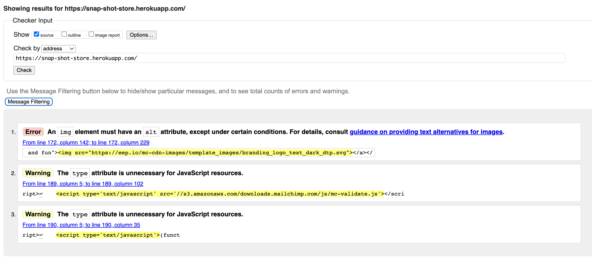
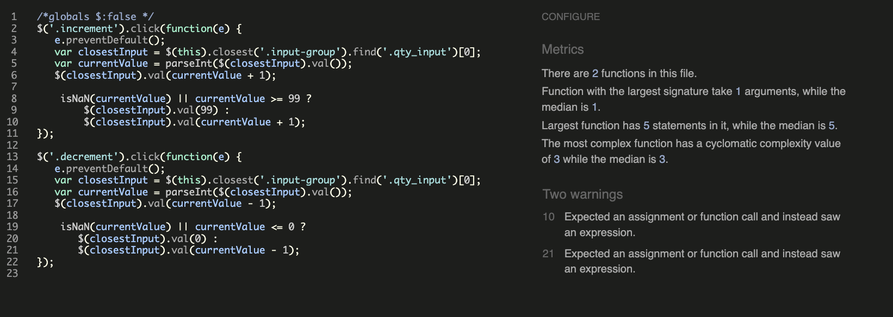

# Testing

## Contents 
   - [Automated Testing](#automated-testing)
      * [HTML validation](#w3c-markup-validator)
      * [CSS validation](#w3c-css-validator)
      * [JS validation](#jshint-javascript-validator)
      * [PEP8 validation](#pep8-validation)
      * [Lighthouse testing](#lighthouse-testing-in-devtools)
      * [Unit testing](#unit-testing)
    - [Manual testing](#manual-testing)
   - [Testing User Stories](#testing-user-stories)
   - [Bugs](#bugs)

## Automated Testing

- Every file in this project was subjected to its file type's respective validator and passed 100% as seen below. Not all results are displayed as many of them look exactly the same however I have picked the files with the largest / more complex code base to demonstrate their results. 

### [W3C Markup Validator](https://validator.w3.org/) 

- Below are the results for the main pages of the site. The home page, products page, product detail page, product edit page, and profile page were chosen to display the main functional pages of the site. The final image is a screenshot of all the errors the validator threw for the checkout page. This is there to show the only errors that were being thrown when pages had to be tested through direct text input.

  - Validation before

    

  - Validation after

    

  - Products before

    
  
  - Products after 

    

  - Product detail 

    

  - Product edit

    

  - Profile

    
  
  - Checkout 

    

### [W3C CSS Validator](https://jigsaw.w3.org/css-validator/#validate_by_input) 

- Again, below are the results for some of the larger, more complex CSS file.

  - styles.css

  

  - products.css

  
  
  - product_detail.css

  

  - product_review.css

  

  - testimonies.css

  
     
### [JSHint JavaScript Validator](https://jshint.com/) 

- The JavaScript in this project was separted into very small files for their respective pages containing perhaps a single function. The largest three files with complex functionality are shown below.

  - Products

  

  - Product detail

  

  - Stripe

  

    
### [PEP8 Validator](http://pep8online.com/)

- Lighthouse Scores
  
  - Home page

  - Product page

  - Product detail page

  - Form pages

    
## Unit Testing 
  - Automated testing was done for some of the project. Forms, models, and views were tested in each app that used a significant amount of code in these files. 

  

  - A coverage report of the project gave a 68% coverage.

## Testing User Stories 

<!-- Using excel spreadsheet numbers, input screenshots of each repective page -->
      
## Manual Testing

- Manual testing of the site was undertaken at every step of development. 

- All URLs were followed to ensure they resolved correctly. An error message page is displayed to a user who tries to navigate to a page they shouldn't have access to and allows them to navigate back to the home page.

- All CRUD functionality on the user end was tested manually. As only the superuser will have access to CRUD functionality, only the superuser can access site management, and add, edit, and delete products from the site.

- Forms have validation and will not post data if any errors are raised.

- The site was tested on Google Chrome using their developer tools and viewed on Firefox, Microsoft Edge, and Safari to ensure it worked across multiple platforms. The site was also viewed on multiple devices of varying screen sizes to ensure its responsive design works as expected. 

## Bugs

  